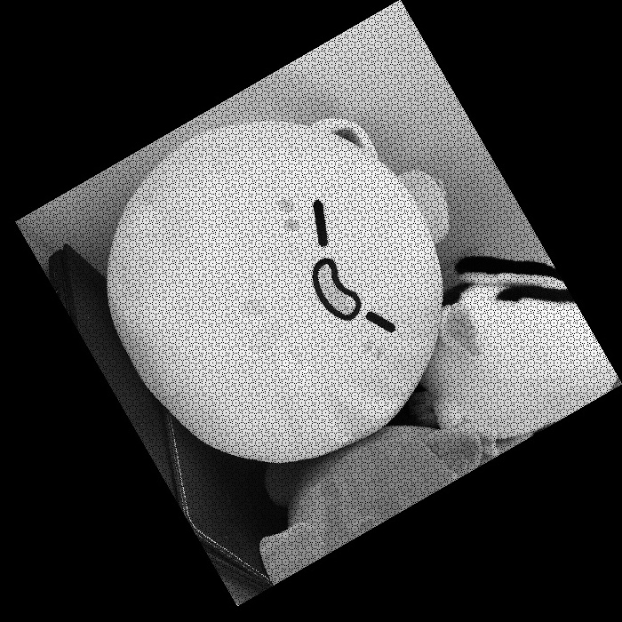

# 幾何変換

画像の幾何変換について勉強して非常に面白いと感じたので，実際にプログラムを書いて理解を深めるために実装してみる．
　そもそも幾何変換とは，与えられた画像f(x,y)に対して，画像の移動や回転などの処理を行うことを指す．
　以下に，学んだ中で簡単な幾何変換を実際にプログラムとして実装したものを理論と一緒に示す．

#### 1．平行移動(translation)
　幾何変換の中で最も単純．画像を指定の地点に並行移動する．
　これは全ての幾何変換に共通することだが，変換前の座標と変換後の座標を行列の積の形で表せると非常に役立つ．
　なぜかと言うと，逆幾何変換（行った幾何変換の取り消し）が逆行列でかけること，複数種類の幾何変換が行列の積としてかける，と言うことが挙げられる．
　実際に平行移動を行列式として考えてみる．最も単純に思いつくのは，変換前の座標を$\left (\begin{array}{cc} x_{1} \\ y_{1} \end{array} \right)$ ，変換後の座標を$\left (\begin{array}{cc} x_{2} \\ y_{2} \end{array} \right)$，移動する距離を$\left (\begin{array}{cc} t_{x} \\ t_{y} \end{array} \right)$とすると，
$$\left (\begin{array}{cc} x_{2} \\ y_{2} \end{array} \right) = \left (\begin{array}{cc} x_{1} \\ y_{1} \end{array} \right) + \left (\begin{array}{cc} t_{x} \\ t_{y}\end{array} \right)$$
という式であるだろう．しかし，これは積の形ではない．理想となるのは行列 $T$ を用いて，
$$\left (\begin{array}{cc} x_{2} \\ y_{2} \end{array} \right) = T\left (\begin{array}{cc} x_{1} \\ y_{1} \end{array} \right)$$
となる行列 $T$ を探すことである．しかし，この式を満たす行列 $T$ は存在しない．なぜならこの平行移動を行う写像が線形ではないからである．
　ではどうするのか？ここでは同次座標という考え方（テクニック）を用いる．同じ次元では不可能なので，次元を増やしてどうにかするというなかなか発想できないアイディアで，学んだ当初は非常に感心した．この考え方はカーネルトリックとも呼ばれていて，機械学習のクラスタリングなどでも活用されている．
同次座標は，座標$\left (\begin{array}{cc} x \\ y \end{array} \right)$を0ではない実数ωを用いて，$\left (\begin{array}{ccc} ωx \\ ωy \\ ω \end{array} \right)$と表現する事を指す．
このとき，全体を $λ$ 倍しても元の座標値は変わらない．そのような考えを同値といい，
$$\left (\begin{array}{ccc} ωx \\ ωy \\ ω \end{array} \right) \sim \left (\begin{array}{ccc} ωxλ \\ ωyλ \\ ωλ \end{array} \right)$$
と表す．このとき，$λ = 1/ω$ とおけば，
$$\left (\begin{array}{ccc} ωx \\ ωy \\ ω \end{array} \right) \sim \left (\begin{array}{ccc} x \\ y \\ 1 \end{array} \right)$$
が得られる．同次座標において最後の成分が１になるようにすれば，元の座標値が得られることがわかる．
　同次座標を用いることで，平行移動を行列を用いて以下のように書くことができる．
$$\left (\begin{array}{ccc} x_{2} \\ y_{2} \\ 1 \end{array} \right) = \left (\begin{array}{ccc} 1&0&t_{x} \\ 0&1&t_{y} \\ 0&0&1 \end{array} \right)\left (\begin{array}{ccc} x \\ y \\ 1 \end{array} \right)$$
ここで，平行移動を表す行列 $T$ を
$$T=\left (\begin{array}{ccc} 1&0&t_{x} \\ 0&1&t_{y} \\ 0&0&1 \end{array} \right)$$
と書くことにすると，
$$\left (\begin{array}{ccc} x_{2} \\ y_{2} \\ 1 \end{array} \right) = T\left (\begin{array}{ccc} x \\ y \\ 1 \end{array} \right)$$
と表すことができる．
translation.py で実装した．

#### 2.剛体変換(Euclidean transform)
　剛体変換とは，数学的にに言えば”画像中の任意の２点間の距離が保たれるような変換”である．
　感覚的には，平行移動と回転を混ぜ合わせた変換である．
　平行移動と同様に行列を用いて表すと，
$$\left (\begin{array}{ccc} x_{2} \\ y_{2} \\ 1 \end{array} \right) = \left (\begin{array}{ccc} \cos\theta&-\sin\theta&t_{x} \\ \sin\theta&\cos\theta&t_{y} \\ 0&0&1 \end{array} \right)\left (\begin{array}{ccc} x \\ y \\ 1 \end{array} \right)$$
と表せる．
　しかし，愚直にこの行列を使って剛体変換を行った画像を見てみると，何かおかしな模様があり，画素が欠損していることがわかる．理論上は $(1.7, 3.6)$ のような少数で表せる座標が存在し，そこにも画素値があるので計算上は完璧に剛体変換が行なえているはずである．しかし，デジタル画像としてサンプリングされているためそういった連続的な画素値は取り扱えない．プログラム上では，こういった少数は整数型に丸め込んでいる．そのため，画素値が参照されない座標が生まれてしまい画素が欠損してしまう．以下の画像は，$π/3$ 回転させ, $x$軸方向に $+600$, $y$軸方向に $+500$ 平行移動させたものを拡大したものである．

    <figure>
        
        <figcaption>図1 画素が欠損した画像</figcaption>
    </figure>

　この画素の欠損を回避するために，逆変換と画素補間という考え方を使う．ここで幾何変換を行列で表していたことが役にたつ．まず行列 $T$ の逆行列 $T^{-1}$ を求める．この逆行列を用いることで変換”前”の座標を求めることができる．そしてその座標の画素値を再サンプリング(画素補間)して，変換後の座標へコピーする．
　画素補間の方法はいくつかあるが，今回は一番単純な最近傍補間(nearest neighbour interpolation)と，ポピュラーな双三次補間(bicubic interpolation)を実装し，比較していこうと思う．

###### 最近傍補間(nearest neighbour interpolation)
　最も単純な補間法であり，補間する座標から最も近い格子点を参照してそのまま補間する座標の画素値にする手法である．座標 $(x,y)$ における画素値 $f(x,y)$ は，以下の式，
$$f(x,y) = f(\lfloor x+0.5 \rfloor , \lfloor y+0.5 \rfloor)$$
により補間される．計算量が少ないので，高速で画素補間を行う必要がある場合に採用される．

    <figure>
        
        <figcaption>図2 最近傍補間</figcaption>
    </figure>

###### 双三次補間(bicubic interpolation)
双三次補間は $f(x,y)$ 近傍の16格子点の画素値を補間に使用する．ここで，表記を簡略化するために画像 $f$ を空間的に $(+\lfloor x \rfloor -1, +\lfloor y \rfloor -1)$だけシフトさせた座標 $(x'(j), y'(i)) = (j+\lfloor x \rfloor -1, i+\lfloor y \rfloor -1)$ ($i,j$ は整数) を考えると，求める $f(x, y)$ は以下のように補間される．また，式が長くなるため，以下の式では $f(x'(j), y'(i))$ を $f(j,i)$ と表記する．
$$
f(x,y) = h_{x}^{T}\left (\begin{array}{cccc} f(0,0)&f(1,0)&f(2,0)&f(3,0) \\ f(0,1)&f(1,1)&f(2,1)&f(3,1) \\ f(0,2)&f(1,2)&f(2,2)&f(2,3) \\ f(0,3)&f(1,3)&f(2,3)&f(3,3)\end{array} \right)h_{y}
$$
ここで，ベクトル $h_{y}, h_{x}$ は
$$
h_{x} = \left (\begin{array}{cccc} h(x) \\ h(x-1) \\ h(2-x) \\ h(3-x) \end{array}\right), h_{y}=\left (\begin{array}{cccc} h(y) \\ h(y-1) \\ h(2-y) \\ h(3-y) \end{array}\right)
$$
であり，$h(t)$ (3次スプライン関数と呼ばれる)としては，
$$
h(t) = 
\begin{cases}
|t|^3-2|t|^2+1 & (|t| \leq 1) \\
-|t|^3+5|t|^2-8|t|+4 & (1 < |t| \leq 2) \\
0 & (2<|t|)
\end{cases}
$$
が一般に用いられている．

    <figure>
        
        <figcaption>図3 双三次補間</figcaption>
    </figure>

　一度の剛体変換では最近傍補間と双三次補間に差を感じにくいが，複数回繰り返すと差がはっきりわかる．
以下に $π/20$ ずつ，10回剛体変換を繰り返したものを示す．

    <figure>
        
        <figcaption>図4 最近傍補間での繰り返し</figcaption>
    </figure>
    <figure>
        
        <figcaption>図5 双三次補間での繰り返し</figcaption>
    </figure>

　みてわかるように，最近傍補間は綺麗に補間できていないことがわかる．対して双三次補間は，比較的綺麗に補間できている．
　剛体変換は euclideanTransform.py, 画素補間は interpolation.py で実装した．